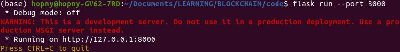
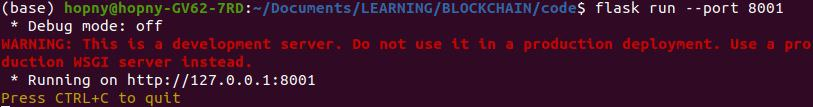
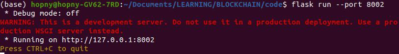
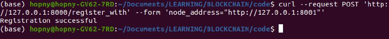
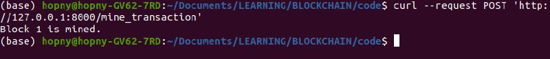
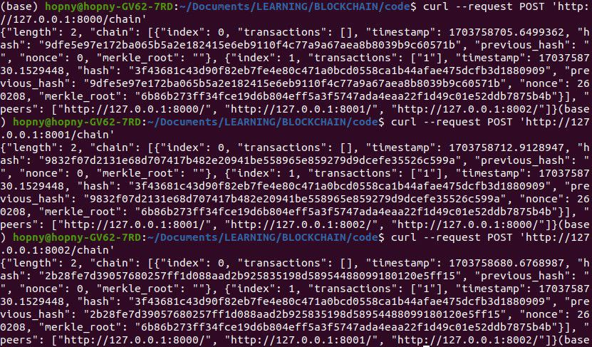

# Build Basic Blockchain by Python

## Table of contents

- [Introduction](#introduction)
- [How to install](#how-to-install)
- [How to run](#how-to-run)
- [Contact](#contact)

## Introduction

This project is built with the purpose of practicing blockchain to understand how it work

## How to install

Install libraries

```bash
cd code
pip install -r requirements.txt
```

## How to run

Your can run by command ```run.sh``` or following bellow tutorial

This step, you need to setup to release node, for example, we want to create 3 node, must open 3 tab terminal and run following command each other.

```bash
flask run --port 8000 # run in tab 1
flask run --port 8001 # run in tab 2
flask run --port 8002 # run in tab 1
```

After runing, this is results
<p align="center">
  
</p>
<p align="center">
  
</p>
<p align="center">
  
</p>

Open new terminal tab (tab 4) and create Peer-to-peer network

```bash
curl --request POST 'http://127.0.0.1:8000/register_with' --form 'node_address="http://127.0.0.1:8001"'
curl --request POST 'http://127.0.0.1:8000/register_with' --form 'node_address="http://127.0.0.1:8002"'
curl --request POST 'http://127.0.0.1:8001/register_with' --form 'node_address="http://127.0.0.1:8002"'
```

<p align="center">
  
</p>

Add transaction into blockchain

```bash
curl --request POST 'http://127.0.0.1:8001/send_data' --form 'data="1"' --form 'target_node="http://127.0.0.1:8000"'
curl --request POST 'http://127.0.0.1:8001/send_data' --form 'data="2"' --form 'target_node="http://127.0.0.1:8000"'
```

To mining
```bash
curl --request POST 'http://127.0.0.1:8000/mine_transaction'
```

<p align="center">
  
</p>

To checking blockchain after mining 

```bash
curl --request POST 'http://127.0.0.1:8000/chain'
curl --request POST 'http://127.0.0.1:8001/chain'
curl --request POST 'http://127.0.0.1:8002/chain'
```

<p align="center">
  
</p>

## Contact
- [Nguyen Y Hop](22C15006@student.hcmus.edu.vn)
- [Cao Canh Linh](22C15034@student.hcmus.edu.vn)
- [Nguyen Hoang Linh](22C15009@student.hcmus.edu.vn)
